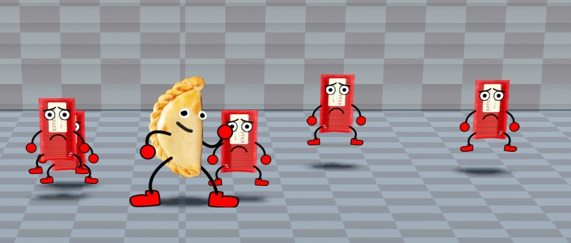

# Comidas Autóctonas [nombre WIP]

## High concept

### 01. Idea general del videojuego

Comidas Autóctonas es un juego de tipo de beat 'em up sidescroller en 2D donde el jugador controla a un grupo de empanadas maestras de artes marciales. Enfrentándose a hordas de enemigos, deberá abrirse paso a través de niveles coloridos y llenos de acción, cada uno representando diferentes ciudades importantes del mundo. El objetivo final es derrotar al malvado Mr. Hot Dog, un villano extraterrestre que invadió el planeta con la ambición de destruir a las comidas caseras y saludables para reemplazarlas por comida chatarra. 

### 02. Características especiales

#### Acción, velocidad y precisión
Los coloridos y animados niveles y enemigos exigirán desplegar todo tipo de estrategias, utilizando en cada uno los reflejos y el intelecto para avanzar.

#### Modo multijugador local
Hasta cuatro jugadores en simultáneo en modo colaborativo para combinar las habilidades y fortalezas de cada uno de los personajes y destruir a todos los enemigos que se crucen en el camino.

#### Sorprendentes efectos visuales
Los veloces y ágiles movimientos de la cámara permiten una visión panorámica de los originales escenarios para no perderse ningún juego de luces y colores y no dejar a ningún oponente sin golpear.

### 03. Perspectiva general
El o los jugadores pueden elegir a una entre cuatro empanadas maestras en un arte marcial, para comenzar a atravesar uno por uno seis niveles que representarán a puntos importantes del mundo. Los enemigos de cada nivel contarán también con características propias del lugar geográfico que es representado en sus vestimentas y en el idioma en que emitan palabras cuando ataquen, sean golpeados o mueran. 

Los enemigos irán apareciendo por grupos en sectores determinados del nivel a medida que el jugador avanza. La cámara detendrá el scrolling por cada grupo de enemigos que aparezca, viéndose el jugador obligado a derrotarlos a todos para que la cámara vuelva a permitirle desplazarse. Algunos enemigos serán pequeños y veloces y aparecerán en grandes cantidades, pero se derrotarán con uno o pocos golpes. Otros enemigos serán más grandes y fuertes, pero más lentos y aparecerán en menor cantidad. 

Al final de cada nivel el jugador se encontrará con un jefe final que será una comida autóctona de la región representada siendo controlada por Mr. Hot Dog a través de un collar eléctrico que la obliga a ser malvada. El jugador debe derrotarla para quitarle el collar y liberarla.

La vida de los personajes es representada con una barra en el borde superior de la pantalla. Esta barra se va achicando en la medida en que el jugador es golpeado por enemigos, y puede volver a llenarse recogiendo ítems que se encuentran desperdigados por el nivel, o son soltados por enemigos tras derrotarlos.

Los jugadores cuentan con una barra de ira que se va llenando cuando se dan o reciben golpes. Una vez que esta barra se llena se habilitan ataques especiales propios de cada personaje. Diferentes tipos de ataques especiales se irán desbloqueando en la medida que se vayan superando ciertos puntajes.

### 04. Motivación del jugador
La combinación de desafío y entretenimiento que ofrece el juego, junto con visuales llamativos, elementos humorísticos y acción frenética, proporcionan una experiencia divertida y atrapante para el jugador. La progresión de habilidades y el desbloqueo de nuevas técnicas proporcionan una experiencia gratificante. El modo cooperativo fomenta la colaboración y la competencia amistosa, y la narrativa de salvar al mundo de una invasión de comida chatarra añade un objetivo claro que impulsa a los jugadores a continuar avanzando.

### 05. Género
Beat ‘em up side scroller 2D

### 06. Público objetivo
El juego apunta a un público joven que disfrute del humor absurdo y los juegos de acción y habilidad en soledad o con amigos, pero también a aquellos de mayor edad que recuerden con nostalgia el boom de los beat ‘em ups en los arcades y consolas de los años ‘90. Será desarrollado para PC.

### 07. Social media
El juego no contará con integración con redes sociales. Propone una experiencia local individual o con grupos de amigos.

### 08. Competencia
Recientemente, ha habido un resurgimiento de videojuegos de este género que evocan nostalgia mientras incorporan mecánicas modernas y adaptadas a los tiempos actuales. Algunos ejemplos podrían ser Streets of Rage (2020), Teenage Mutant Ninja Turtles (2022), Shredder’s revenge, Power Rangers Rita's Rewind (anunciado para 2024).

### 09. Argumentos únicos de venta
Comidas Autóctonas combina toda la acción de los beat ‘em ups clásicos con elementos de comedia absurda, gráficos totalmente animados, un comportamiento de cámara novedoso que redobla la jugabilidad y cantidad de enemigos en pantalla y la posibilidad de vivir aventuras multiplayer de dos, tres o hasta cuatro jugadores.
La variedad de movimientos de los personajes, junto con las características y habilidades propias de cada uno, dan lugar a que cada partida multiplayer sea una experiencia diferente e invite al despliegue de múltiples y originales estrategias. 
El registro y los premios por puntaje invitan a la competencia entre amigos por los primeros puestos y el desbloqueo de todas las habilidades secretas. 
Por último, la banda sonora que combina chiptune con variedades de ritmos, y los ingeniosos efectos de sonido  visitan la nostalgia de todos aquellos que hayan sabido disfrutar de repartir golpes en los beat ‘em ups clásicos de arcades y consolas de los años 90’s, o sorprender a los jóvenes que estén conociendo este género de videojuegos en la actualidad

### 10. Plataforma
El juego estará disponible para PC

### 11. Metas de diseño
Equilibrio entre nostalgia y modernidad: evocar la nostalgia de los beat 'em up clásicos, pero que también introduzca mecánicas y gráficos modernos para atraer a una audiencia contemporánea.
Diversidad de personajes y habilidades: desarrollar una variedad de personajes memorables tanto jugables (empanadas maestras en artes marciales), como no jugables (comida chatarra enemiga)  cada uno con habilidades únicas que propongan diferentes estilos de juego y estrategias.
Cooperación y competencia: implementar un modo cooperativo para hasta cuatro jugadores, que fomente la colaboración y el trabajo en equipo, así como la competencia mediante  registro de puntuaciones y desafíos.
Variedad de escenarios y enemigos: diseñar niveles inspirados en ciudades emblemáticas del mundo, cada uno con enemigos y obstáculos únicos, para mantener la experiencia fresca y emocionante.
Humor y entretenimiento: incluir elementos de humor grotesco y situaciones cómicas que añadan diversión al juego, creando momentos memorables y entretenidos para los jugadores.
Progresión y personalización: ofrecer sistemas de progresión que permitan a los jugadores desbloquear nuevas habilidades y personalizar a sus personajes, incentivando la rejugabilidad y el compromiso a largo plazo.
Desafío atractivo: asegurar un nivel de dificultad que sea desafiante pero justo, manteniendo a los jugadores comprometidos y motivados para superar los retos del juego.
Narrativa enganchante: desarrollar una narrativa atractiva en la que los jugadores deben derrotar a Mr. Hot Dog y salvar al mundo de la comida chatarra, y contarla de una manera equilibrada que no interfiera el flujo del juego.

### 11. Plazos de desarrollo
Tiempo total estimado: entre 14 y 20 meses
Concepto y preproducción: 4 a 6 meses
Desarrollo: 6 a 8 meses
Prueba y ajustes: 4 a 6 meses
